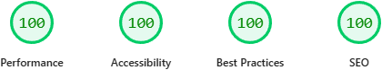
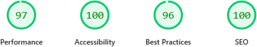

 
    

<h1 align="center">Goods Panda</h1>
<h4 align="center">Modern, Responsive E-commerce Landing Page</h4>

    <a href="https://goodspanda.netlify.app/">Live Site</a> •
    <a href="https://github.com/shantoopaul/goods-panda#readme">Documentation</a> •
    <a href="https://github.com/shantoopaul/goods-panda">Source Code</a>

    

<h2>Tech Stack</h2>

This website is built for speed, resilience, and geospatial accuracy.

<table>
  <thead>
    <tr>
      <th><strong>Component</strong></th>
      <th><strong>Technology</strong></th>
      <th><strong>Description</strong></th>
    </tr>
  </thead>
  <tbody>
    <tr>
      <td><strong>Frontend</strong></td>
      <td>
        
      </td>
      <td>HTML5 and CSS3 is used the make the frontend UI</td>
    </tr>
    <tr>
      <td><strong>Deployment</strong></td>
      <td>
        
      </td>
      <td>Netlify is used to deploy this project</td>
    </tr>
  </tbody>
</table>

<h2>File Structure</h2>
<pre>
.
├── assets                  # Images and icons are stored here
├── index.html
├── styles.css
└── README.md
</pre>

<h2>PageSpeed Insights Performance Score</h2>
<table align="center">
    <thead>
        <tr>
        <th>Desktop</th>
        <th>Mobile</th>
        </tr>
    </thead>
    <tbody>
        <tr>
        <td>
            <kbd>
            
            </kbd>
        </td>
        <td>
            <kbd>
            
            </kbd>
        </td>
        </tr>
    </tbody>
</table>

<h2>Issues</h2>

If you find any bug or issue while browsing the site, please <a href="https://github.com/shantoopaul/goods-panda/issues/new">open an issuse</a> and let me know!
